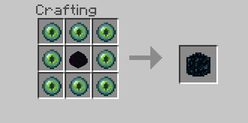
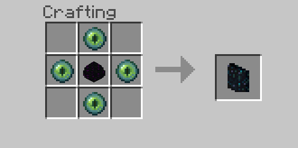

# End Portal Recipes

This is an add-on for **[Minecraft: Bedrock Edition][bedrock-wiki]**.
It adds custom recipes for usually unobtainable blocks. Current additions
include the end portal and end gateway.

## Download

You can download the latest release by heading over to our [releases page][releases-page]. Once it is downloaded, launch the file and add it to your world via the behaviour packs section.
**Note: As of 1.12, adding crafting recipes is an experimental feature, meaning you must also enable experimental features on your world**

## Recipes

**The dragon egg will not be used up in the recipe**

### End Portal

The portal block used to teleport to the end:

### End Gateway

The gateway block used to teleport away from the outer end islands:

[bedrock-wiki]: https://minecraft.gamepedia.com/Bedrock_Edition
[releases-page]: https://github.com/mcpacks/end-portal-recipes/releases
